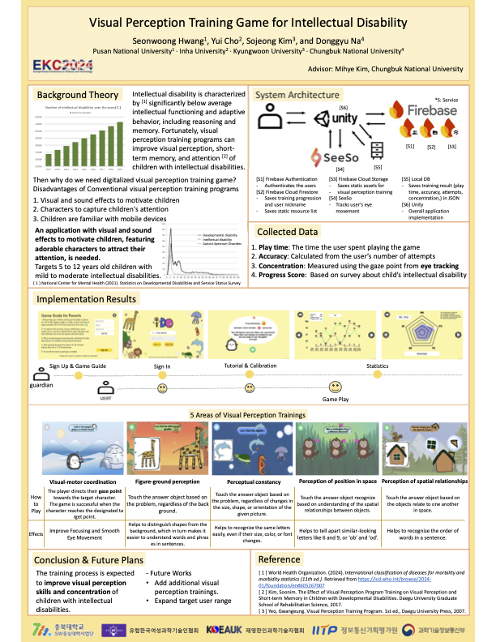

## GAID

🧠 Visual Perception Training Game for Children with Intellectual Disabilities
👑 2nd Place @ ICCAS 2024 (UK)

⸻

### 🎯 Project Overview

GAID (Game for Attention and Intellectual Development) is a Unity-based mobile game that aims to enhance the visual perception, short-term memory, and concentration of children aged 5–12 with mild to moderate intellectual disabilities.

👧👦 “An engaging game with visual/audio effects and eye-tracking designed for neurodiverse learners.”

⸻

### 📅 Duration

2024.03.26 ~ 2024.08.05

⸻

### 🌍 Competitions
 - 🇬🇧 ICCAS 2024 – 2nd Place Winner 🏆
 - 🇬🇧 EKC 2024

⸻

### 🧠 Why This Game?

Traditional visual perception training programs have key limitations:
 - ❌ Lack of motivation due to static content
 - ❌ Insufficient engagement from children
 - ❌ Not optimized for mobile familiarity

GAID solves this with:
 - ✅ Interactive gameplay using eye-tracking (SeeSo SDK)
 - ✅ Cute characters & sound effects to keep users engaged
 - ✅ Familiar mobile interface & gamified structure

⸻

### 🏗 System Architecture
- [S1] Firebase Authentication – 사용자 인증
- [S2] Firebase Firestore – 훈련 진행도 및 유저 정보 저장
- [S3] Firebase Cloud Storage – 정적 리소스 저장
- [S4] SeeSo – 시선 추적 (Eye Tracking)
- [S5] Local DB – 훈련 결과 저장 (JSON)
- [S6] Unity – 전체 앱 구현

⸻

### 📊 Collected Metrics

Metric	Description
Play Time	Total duration of game interaction
Accuracy	Attempts vs. correct answers
Concentration	Gaze-based attention measurement using SeeSo
Progress Score	Survey-based scoring reflecting intellectual disability severity

⸻

### 🎮 Training Areas

Visual Perception Type	Description
Visual-Motor Coordination	Gaze at target character to move it to destination
Figure-Ground Perception	Distinguish target object from background
Perceptual Constancy	Recognize same object regardless of size/orientation changes
Perception of Position	Understand spatial relationships between objects
Spatial Relationships	Identify relational position between multiple objects

⸻

### 🛠 Technologies Used
- Unity (C#)
- Firebase Suite (Auth, Firestore, Storage)
- SeeSo SDK – Gaze tracking
- Android/iOS platform support

⸻

### 🔮 Future Plans
- ➕ Add more training modules and levels
- 🌍 Expand support to wider age groups and other disabilities
- 📈 Conduct empirical research for efficacy validation

⸻

### 🙋‍♀️ Contributors
	•	Seonwoong Hwang (Pusan National Univ.)
	•	Yui Cho (Inha Univ.)
	•	Sojeong Kim (Kyungwoon Univ.)
	•	Donggyu Na (Chungbuk National Univ.)
	•	Advisor: Mihye Kim (Chungbuk National Univ.)

⸻

### 🖼️ Poster

